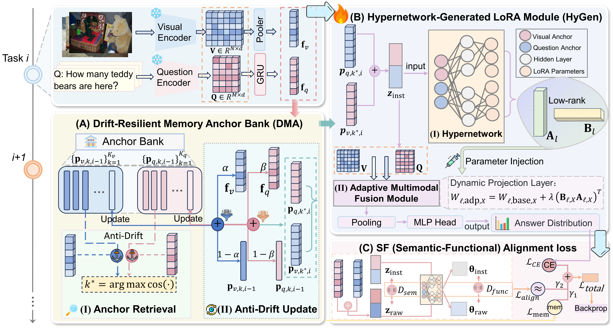

## 🔍 HyLoVQA: Dynamic Hypernetwork-Generated Low-Rank Adaptation for Continual Visual Question Answering

**HyLoVQA** is a continual visual question answering (VQA) framework designed to adapt across tasks under non-stationary streams while remaining parameter-efficient and robust to drift-induced interference (Figure 1). It achieves this by maintaining a Drift-Resilient Memory Anchor Bank that stores compact anchors for visual objects and textual tasks and updates them with current input features to stay stable over time; by using a Hypernetwork-Generated LoRA module in which a hypernetwork produces lightweight LoRA adapters from retrieved anchors to enable dynamic per-task/per-object adaptation while reducing interference from shared backbone updates; and by introducing a Semantic–Functional Alignment loss that connects semantic discrepancy in feature space to functional change in parameter space, discouraging updates that deviate from the current task and object.
<p align="center">
  
</p>

---

## 📁 Data Preparation

Download the required datasets and place them in the specified directories:

- Download the partition of VQA v2 from [Google Drive](https://drive.google.com/file/d/11gx7AxyeMP1KVuzHErIfNKCLeBWGq3pE/view?usp=share_link) and put it into: `datasets/vqa/Partition_Q`.
- Download the partition of NExT-QA from [Google Drive](https://drive.google.com/file/d/1lwWL_PhNKactFEqQF8IVx-HeJEuboe8D/view) and put it into `datasets/nextqa/Partition_Q`.
- Download `datasets/COCO` from [Google Drive](https://drive.google.com/drive/folders/1MBBhlkP83VMKS2Qe0SmFfzkHhMpIG5wf?usp=sharing).
- Download video features of NExT-QA from [Goolge Drive](https://drive.google.com/file/d/1rS5X_t_VSDF4uP3HL1gPQ0ZgWIEuglgk/view****).

---

## 🧪 HyLoVQA Task Execution

```bash

# Standard Training & Testing VQA v2
bash HyLoVQA-main/scripts/HYLOVQA_train.sh 1      
bash HyLoVQA-main/scripts/HYLOVQA.sh 1            

# Novel Composition Training & Testing VQA v2
bash HyLoVQA-main/scripts/HYLOVQA_NOV_train.sh 1  
bash HyLoVQA-main/scripts/HYLOVQA_NOV.sh 1        

# Standard Training & Testing NExT-QA
bash HyLoVQA-main/nextqa/train.sh 1    

# Novel Composition Training & Testing NExT-QA
bash HyLoVQA-main/nextqa/train_nov.sh 1

```
